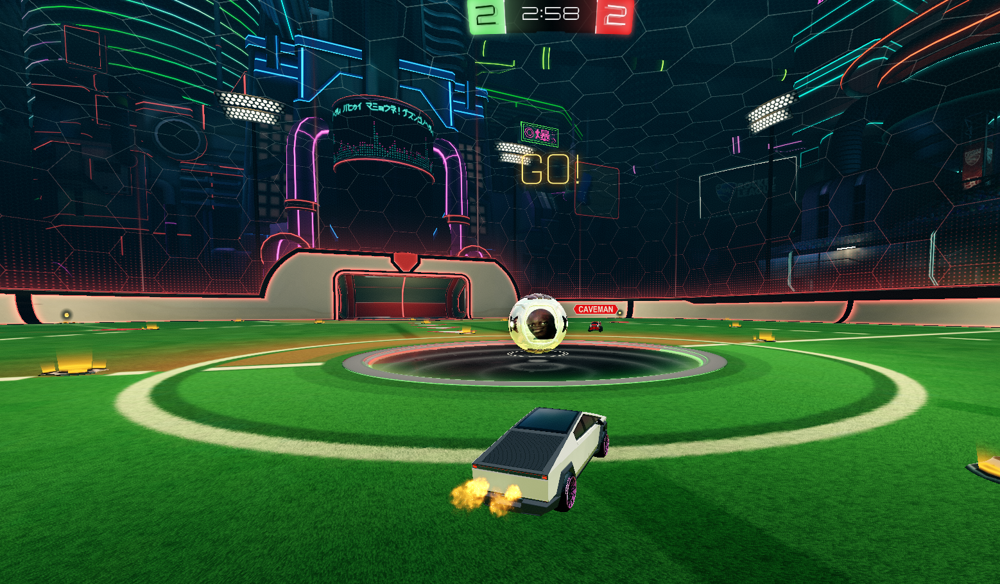

# Custom Ball Online (BakkesMod plugin)
Enables custom ball textures in online matches

 

Works with the latest version of [AlphaConsole](https://bakkesplugins.com/plugins/view/108) 😄

 

## 🎮 How to use

1. Have [AlphaConsole](https://bakkesplugins.com/plugins/view/108) installed (and this plugin)

2. Have a ball texture selected in AlphaConsole
   
3. Join a match, and your ball texture should automatically be applied

 

>[!TIP]
>Bind the `cbo_apply_ball_texture` command to manually apply the ball texture whenever you want
>
>(like in case the texture wasn't automatically applied for some reason)

 

## 🔧 How to install

Follow the steps in [Releases](https://github.com/smallest-cock/Custom-Ball-Online/releases/latest)

 

## 🚧 Errors / Troubleshooting

Join [the discord](https://discord.gg/tHZFsMsvDU) if you have questions, errors, or need help
