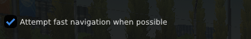
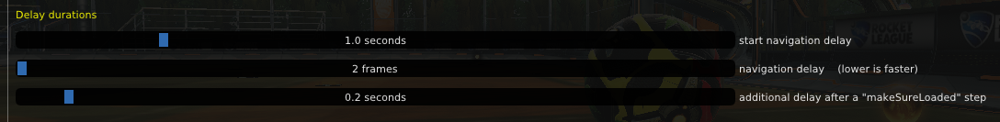
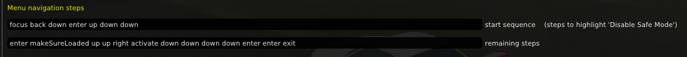

# Settings

## Fast navigation

If this is enabled, the IDs for three important menu items ("Disable Safe Mode" button, "Cosmetics" tab, & ball texture dropdown) will be stored and used in future runs (if possible) in order to *directly* activate those items, which is faster and more reliable than using "blind" menu navigation steps

However, sometimes the IDs change (idk why, it happens almost randomly... maybe has something to do with them being generated from pointers?) In this case, any stored IDs will be cleared, and a regular "blind" run (using navigation steps) will be done in order to get new/updated IDs

## Delay durations

The above settings work well for my PC running RL at 165 fps ......

**My PC specs for reference:** 

| | |
|---|:---:|
**CPU** | AMD Ryzen 5 3600X
**GPU** | AMD RX 580
**RAM** | 16 GB DDR4

### start navigation delay
Determines how long to wait after reloading the AlphaConsole plugin to begin menu navigation. This is important to give bakkesmod sufficient time to reload AlphaConsole and display/load its menu properly. 

This value may be lowered on better/faster PCs. And vice versa for slower PCs, it may need to be increased. Find what works well for your PC

### navigation delay
Determines the delay between each menu navigation step. Measured in frames, which means it depends on your game fps

*Example:* A 10 frame delay with RL running @ 60 fps will last 1/6th of a second... but the same 10 frame delay will only last 1/20th of a second on RL running @ 200 fps.

I'm not 100% sure, but I think random frame drops affect menu navigation. Which would mean a very low delay (like 2 frames) will make it more likely for a random frame drop to cause an error. Aka, if navigation steps are performed once every 2 frames, a random frame drop has a 50% chance of affecting navigation. As opposed to something like a 10 frame delay, where the chance is only 10%

### delay after a `makeSureLoaded` step
This gives AlphaConsole some extra time to finish loading all of its modules (after the Disable Safe Mode button has been activated) before resuming menu navigation steps. Idk if it's completely necessary, but it seems like it may help reduce errors by giving a bit of breathing room

## Menu navigation steps

These are the "directions" to automate menu navigation in AlphaConsole. Here are the different possible steps:

|step | description|
|:---|:---|
`up` | move up
`down` | move down
`left` | move left
`right` | move right
`enter` | activate the highlighted item (which should result in a different item becoming highlighted)
`activate` | activate the highlighted item (which should result in it still being highlighted)
`back` | go "back" in focus (i.e. if the focus is somewhere in a submenu, it will go back to the root menu)
`alt` | switch between menus in a window (simulates pressing the `alt` key)
`focus` | bring focus to the AlphaConsole window
`makeSureLoaded` | pause menu navigation until all modules of the AlphaConsole plugin have been loaded
`resetNav` | set the navigation focus ID to 0 (reset the navigation focus)
`exit` | execute the exit command

### start sequence
This is the sequence of steps that each run will start with. The goal is to leave off with the "Disable Safe Mode" button highlighted every time. If the "Disable Safe Mode" button isn't highlighted by the end of this sequence, something went wrong...

### remaining steps
These are the remaining navigation steps to perform after the "Disable Safe Mode" button has been highlighted. These steps should activate the "Disable Safe Mode" button → wait for AlphaConsole to load its modules/menu → activate the "Cosmetics" tab → activate the ball texture dropdown → then activate the first highlighted option (which should be the most recent ball texture used)

>[!IMPORTANT]
>In the default `remaining steps`, there should only be 2 `down` steps for Steam users, but 4 `down` steps for Epic users. Make sure it's correct in your case.

## Commands

These are ran at the very beginning and end of a run.

The start command should reload AlphaConsole and open its menu. The exit command should close the menu.

`plugin reload acplugin` is the most important part... without it, custom ball textures will not work

