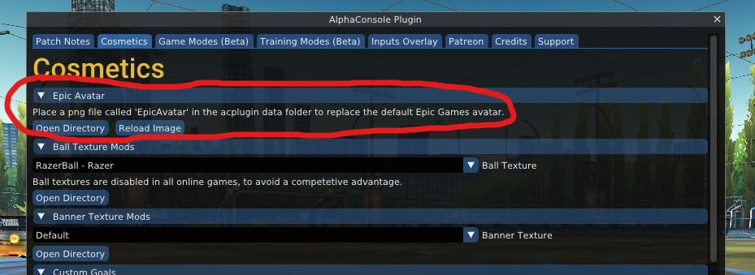
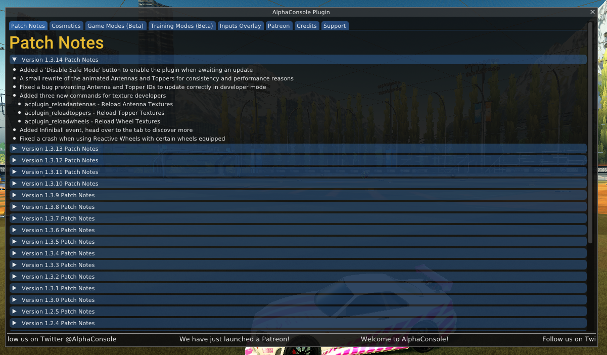
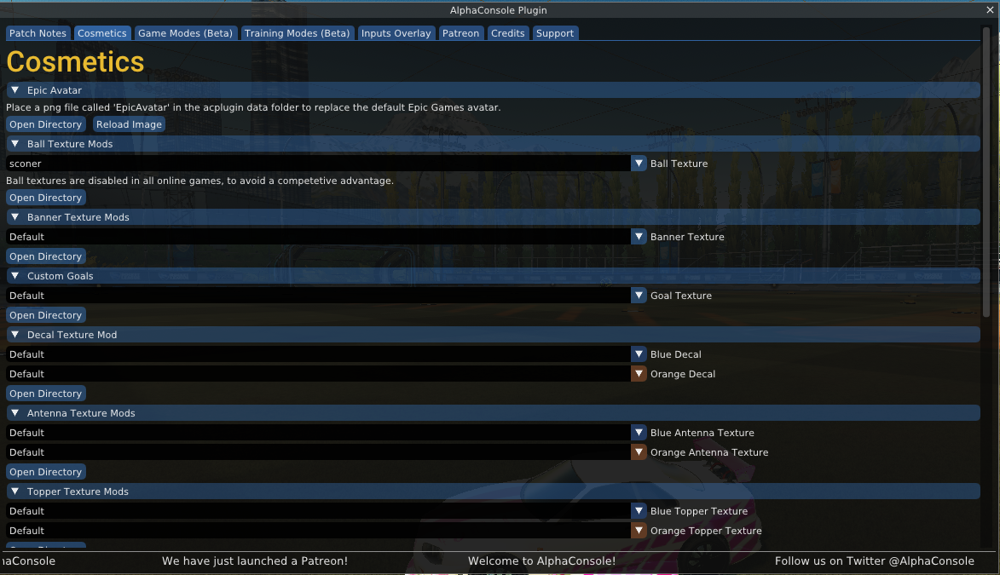
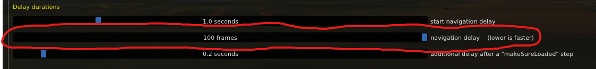

<br>
<br>

First... make sure you have good [settings](./Settings.md)

## If ball texture only appears after a goal is scored
This means the ball texture and/or the ball texture dropdown (in the AlphaConsole menu) isn't being activated

One reason this can happen is if the steps listed your `remaining steps` (in plugin settings) are meant for Epic users, but you're on Steam... or vice versa. These are the correct `remaining steps` for each platform:

| Platform | Steps |
|:---|:---|
Epic | ```enter makeSureLoaded up up right activate down down down down enter enter exit```
Steam | ```enter makeSureLoaded up up right activate down down enter enter exit```

Notice how there are only 2 `down` steps for Steam, compared to the 4 for Epic. This is because Steam users don't need to navigate past the "Epic Avatar" dropdown (they don't have it):




## If menu navigation steps seem wrong

### First:

Manually open the AlphaConsole menu (F5) and make the menu items look like this:





..... open/close any dropdowns or menu trees if you need to.


### If they still seem wrong:



Try cranking up the navigation delay in order to allow a longer time between each step... so you have time to see what's going wrong and what needs to be changed

Then you can edit the menu navigation steps accordingly
